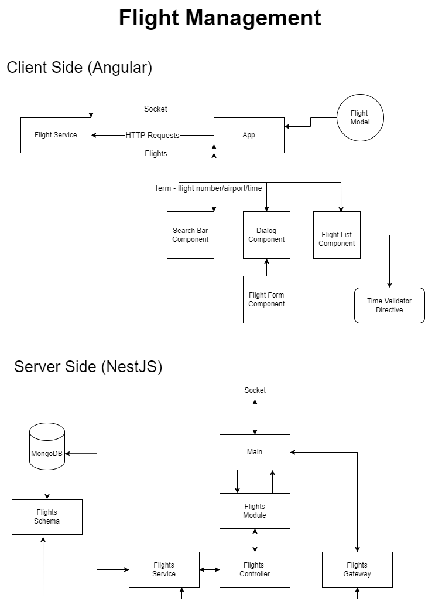

# Flight Management 

A flight management app for an airline company. Monitor real-time data from flights owned by the company, such as: takeoff/landing times, takeoff/landing airports and flight status.



## Features

1. A list view of all flights registered in the system, always up to date with their current data on the server.
2. A search bar to filter flights by flight number and takeoff/landing airport. The app should still update data even when the UI shows filtered results.
3. A flight create/edit form.
4. A database of flights
5. Endpoints serving CRUD for flight entities, including a query that filters by flight number, airport, and time.
6. A push-update system through which the Front-End would be able to detect changes.

### Technologies

* TypeScript, HTML, SCSS
* Angular
* RxJS, Angular services
* Angular Material
* NestJS
* MongoDB
* Sockets (Socket.IO)


## CI/CD (Github actions)

located in **feature/cicd** branch

Using a worflow in github action that will run inside an AWS instace the docker compose file which will up 3 containers(angular, nestjs and mongodb).
Everytime we push a new code to the repo the action will be triggered and re-up the containers on the insatnce. 

### Fronted Dockerfile

```
# Stage 1 (Angular)
FROM node:18-alpine as angular

WORKDIR /app

COPY package*.json ./

RUN npm install

COPY . .

RUN npm run build

# Stage 2 (Nginx)
FROM nginx:stable-alpine

COPY --from=angular /app/dist/flight-management-angular/browser/ /usr/share/nginx/html

EXPOSE 80
```

### Backend Dockerfile

```
FROM node:18-alpine

WORKDIR /usr/src/app

COPY package*.json ./

RUN npm install

COPY . .

CMD [ "npm", "start" ]
```

### Docker compose file

```
version: '3'
services:
  flight-management-nestjs:
    build:
      context: ./flight-management-nestjs
      dockerfile: Dockerfile
    volumes:
      - ./flight-management-nestjs:/usr/src/app
      - /usr/src/app/node_modules
    environment:
      NODE_ENV: development
      PORT: 3000
      DATABASE_URL: mongodb://mongodb:27017/flightsdb
    depends_on:
      - mongodb
    ports:
      - 3000:3000

  flight-management-angular:
    build:
      context: ./flight-management-angular
      dockerfile: Dockerfile
    volumes:
      - ./flight-management-angular:/usr/frontend/src/app
      - /usr/frontend/src/app/node_modules
    ports:
      - 4200:80
    expose:
      - 80
  mongodb:
    image: mongo:latest
    ports:
      - 27017:27017
    volumes:
      - dbdata6:/data/db
    environment:
      MONGO_DB: flightsdb
volumes:
  dbdata6:
  ```